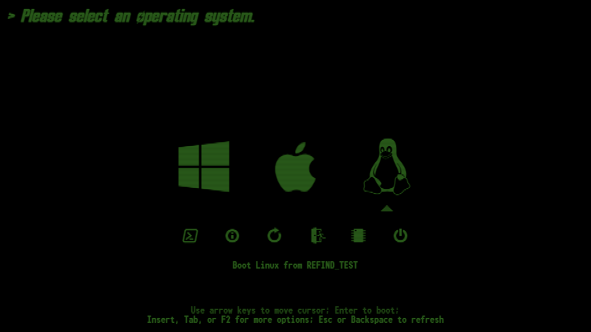

# rEFInd-fallout

A Fallout-inspired rEFInd theme.



## Installation

1. Locate your rEFInd directory, commonly `/boot/EFI/rEFInd`.

2. Create a folder called `themes`, and clone this repository inside of it:

```bash
cd /boot/EFI/rEFInd
mkdir themes
cd themes
git clone https://github.com/awanwar/rEFInd-fallout.git
```

3. Lastly, include this theme at the bottom of your `refind.conf` file in your rEFInd directory:

```bash
include themes/rEFInd-fallout/theme.conf
```

## Resolution and Sizing

Due to the scanline effects being embedded inside `.png` files, it's recommended to neither adjust the resolution of your rEFInd configuration to anything other than `1920x1080`, nor adjust the default icon sizes. Doing so may cause warpage and stretching that could lead to an inconsistent look.
